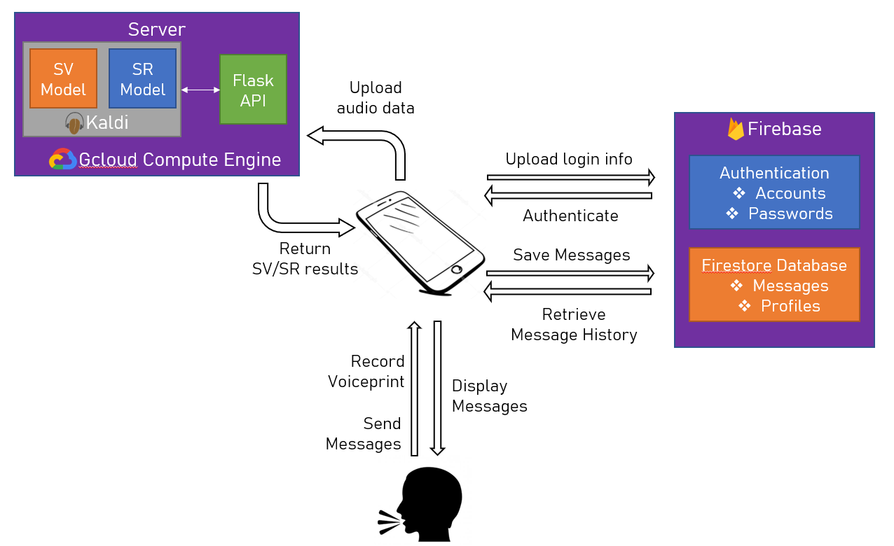

# Open Sesame

**The server hosting the codes were already disabled. This repository now solely serves as a record of previous progress.**

Open Sesame is a project that aims to implement voiceprint biometrics into daily applications. The main goal of this project includes:

- Reproducing current speaker verification models
- Optimizing models with Cantonese data
- Integrating the model with speech recognition for extra security
- Develop a messaging application that interacts with the model

## Architecture

The developing stack consists of three main parts: 

1. Server with machine learning models and API
2. Firebase for authentication control and user data storage
3. React Native application with UI components

## Speaker Verification / Speech Recognition

Speaker Verification refers to the technology that helps identify if two voiceprints origin from the same person. Models used in this project are referenced from [Dan Povey's paper on Speaker Recognition](https://www.danielpovey.com/files/2018_icassp_xvectors.pdf), especially the use of x-vectors to represent speaker characteristics from an analog audio.

The model architecture remained unchanged during the experiemental process of this project, although we did tamper with parameters such as data repetition rate when training new models from Cantonese data.

Experiements on Speech Recognition follows a similar procedure, where we follow the model architecture from the [Kaldi toolkit](https://github.com/kaldi-asr/kaldi) and train it with Cantonese data.

Since both models are designed to be called from machine-dependent bash scripts, an API was implemented with Python on the server to help the application interact with it.

## Expanding Ideas
- Message Encryption
- Reactive CSS for various screen size
- Revamp database for efficient data storage
- Different server hosting options for scaling (e.g. Kubernetes)